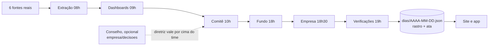

# Capivara Asset

Uma gestora de ativos **fictícia** que vive só no GitHub, operando sobre **dados públicos reais**
(Banco Central, Tesouro Direto, B3, Yahoo Finance). A ideia desenvolvida está em [`IDEIA.md`](IDEIA.md).

> Empresa e fundo fictícios. Nada aqui é recomendação de investimento.

**Site:** `https://gloedenjoao.github.io/profissional/` (também aberto pelo app Android,
[`GloedenJoao/android` → `apps/gestora`](https://github.com/GloedenJoao/android/tree/main/apps/gestora)).

## Duas coisas separadas, o mesmo motor

| | **Experimento** | **Simulação** |
|---|---|---|
| O que é | a empresa funcionando no presente | a mesma empresa refazendo 2026 desde 1º de janeiro |
| Para que serve | descobrir se uma gestora tocada por regras sobre dados reais se sustenta | testar o experimento antes de confiar nele |
| Quem faz andar | sozinha, seg–sex 08h ([`fechamento.yml`](.github/workflows/fechamento.yml)) | o dono: "Simular próximo dia" no site/app ([`simulacao.yml`](.github/workflows/simulacao.yml)) |
| Onde mora | `dados/` e `empresa/` | `cenarios/2026/` |
| No site | `#/experimento` | `#/simulacao` |

## O dia útil, etapa por etapa

O motor (`gestora/`) roda cada dia útil em sete etapas. Cada uma só enxerga o que a anterior entregou e grava no
**rastro do dia** (`dias/AAAA-MM-DD.json → rastro`) o que recebeu, a regra que aplicou, a conta que fez e a origem
de cada número (real, derivado, simulado, decisão, conselho, regra). As falas da reunião (`ata`) são escritas a
partir do rastro e apontam para o bloco que as sustenta: no site, cada fala tem "Ver as contas".

| hora | etapa | quem | o que faz |
|---|---|---|---|
| 07:00 | Herança | — | o fechamento de ontem é o ponto de partida (no 1º dia, a fundação) |
| 08:00 | Extração | Bia, Téo | confere o que as 6 fontes reais publicaram até as 08h, trata incidentes, roda o teste de estresse e libera as séries |
| 09:00 | Dashboards | Caio, Lia | monta 10 indicadores com o que foi liberado, decide o que fazer com o dado que faltou, confere a qualidade e as estimativas antigas |
| 10:00 | Comitê | Helena, Rafael, Marta | pauta do dia, modelo de alocação (`alvo = neutro + sensibilidade × sinal`) e equipe/orçamento da Extração |
| 18:00 | Fundo | Administrador | marca a carteira com os preços oficiais do dia, CDI, taxa, cotistas, rebalanceamento e carteira de referência |
| 18:30 | Empresa | Helena | receita de taxa contra os custos da casa |
| 19:00 | Verificações | — | 8 conferências de integridade (nada do futuro, contabilidade fecha, limites, preços batem com a fonte…) |

Princípios:

- **Nada do futuro.** As reuniões só conhecem o que estava publicado às 08h, pelo calendário real de cada fonte
  (preços e CDI do dia anterior; Focus às segundas; IPCA do mês M a partir do dia 15 de M+1). O fundo é marcado às
  18h com o fechamento do dia. A verificação `sem_futuro` confere isso todo dia.
- **Real é real; simulado aparece como simulado.** O teste de estresse sorteia falhas nas fontes (as reais quase
  nunca falham) e mostra a chance, o número sorteado e a semente. Cotistas seguem um modelo sem sorteio.
- **Determinístico.** O mesmo dia, com os mesmos dados e regras, dá sempre o mesmo rastro.
- **Mensurável.** A carteira de referência (alocação neutra, sem comitê) mede o valor das decisões; a aba
  Validação junta as verificações e as métricas de saúde do processo.
- **Regras à vista.** Todos os parâmetros estão em `empresa/politicas.json` (e `cenarios/2026/empresa/`), e a aba
  Regras do site mostra o motor por dentro com os valores vigentes.



## Workflows

| workflow | quando | faz |
|---|---|---|
| `fechamento.yml` | seg–sex 08h e manual | experimento: extração real, o dia, verificações (se uma falha, nada é publicado), issues de alerta, dados e site |
| `simulacao.yml` | botão no site/app, manual ou `/avancar` na issue de controle | simulação: um dia (ou `recomecar: true` para voltar ao zero), verificações, dados e site |
| `publicar.yml` | push na `main` em `gestora/` ou `site/` | se o motor mudou de versão, refaz o histórico dos dois (sem rede) e republica o site |
| `ci.yml` | PR e push | testes, validação das políticas/diretrizes, ensaio do próximo dia de cada cenário e auditoria das verificações |

O site acompanha as execuções ao vivo: na Simulação, depois do clique, mostra os passos do Actions até o dia novo
chegar e começar a tocar; no Experimento, mostra o fechamento das 08h enquanto ele roda. Na primeira simulação pelo
site é preciso um token *fine-grained* só do repositório `profissional` com **Actions: Read and write** (fica só no
navegador).

## Estrutura

| Pasta | O que tem | Quem escreve |
|---|---|---|
| `gestora/` | motor em Python puro: `simulacao.py` (etapas), `times.py` (decisões), `rastro.py`, `verificacoes.py`, `regras.py`, `fontes.py` (conectores) | PRs de código |
| `dados/` | experimento: séries reais, estado, `dias/` (rastro), histórico, `painel.json`, `briefing.md` | só o workflow |
| `empresa/` | `politicas.json` e diretrizes opcionais do conselho em `decisoes/AAAA-MM-DD.json` | humanos, por PR |
| `cenarios/2026/` | simulação: `cenario.json`, `empresa/` e `dados/` próprios | `empresa/` por PR; `dados/` só o workflow |
| `site/` | o site (HTML + JS + CSS, gráficos em SVG) | PRs de código |
| `tests/` | testes do motor, parsers com respostas reais gravadas | PRs de código |

## Rodar localmente

```bash
python -m pytest -q                                   # testes
python -m gestora validar                             # políticas e diretrizes
python -m gestora reprocessar --todos                 # refaz os dois cenários com o motor atual (sem rede)
python -m gestora auditar --todos                     # confere as verificações de todos os dias
python -m gestora --cenario 2026 avancar --dias 1     # simula o próximo dia (precisa das fontes, ou --sem-extracao)
python -m gestora site _site && python -m http.server -d _site 8000   # site em http://localhost:8000/
```

Uma vez só, para publicar o site: **Settings → Pages → Build and deployment → Source: GitHub Actions**. Rotas:
`#/`, `#/experimento/dia/AAAA-MM-DD`, `#/simulacao/{dia,fundo,dados,empresa,validacao,regras}`. O `painel.json` do
experimento continua na raiz do site (o app Android lê de lá) e mantém os campos antigos; os da simulação ficam em
`cenarios/2026/`.
