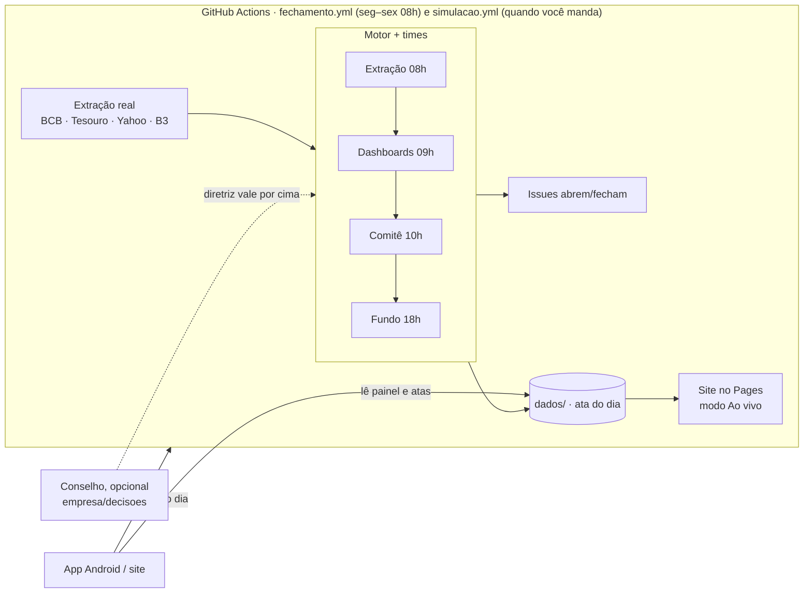

# Capivara Asset

Uma gestora de ativos **fictícia** que vive só no GitHub, operando sobre **dados públicos reais**
(Banco Central, Tesouro Direto, B3, Yahoo Finance). Todo dia útil ela extrai os dados, sofre com
fontes que atrasam ou saem do ar, monta os painéis com o que tem, decide e sente as consequências.

> Empresa e fundo fictícios. Nada aqui é recomendação de investimento.

- **Site (GitHub Pages):** `https://gloedenjoao.github.io/profissional/`. A aba **Ao vivo** de cada
  cenário toca as reuniões dos times fala por fala e segue sozinha quando chega um dia novo (a página
  confere a cada minuto, sem Shift+F5). Aberto também pelo app Android
  ([`GloedenJoao/android` → `apps/gestora`](https://github.com/GloedenJoao/android/tree/main/apps/gestora)).
- **Processos:** [issues com rótulo `simulacao`](https://github.com/GloedenJoao/profissional/issues?q=label%3Asimulacao)
  (alertas do dia a dia, abrem e fecham sozinhas).
- **Ideia original:** [`IDEIA.md`](IDEIA.md) · **manual do conselho (opcional):** [`OPERACAO.md`](OPERACAO.md).

## Quem decide: os times

Ninguém precisa escrever decisão. Cada área tem um time (`gestora/times.py`) que se reúne todo dia útil,
na ordem em que a informação chega, e decide só com o que a área anterior entregou:

| hora | time | decide |
|---|---|---|
| 08:00 | **Extração** (Bia, Téo) | ação de cada incidente: `aguardar`, `fonte_alternativa`, `corrigir_conector` ou `escalar` quando falta gente |
| 09:00 | **Dashboards** (Caio, Lia) | o que publicar quando falta dado: `usar_ontem`, `estimar` ou `suspender`; lembra das estimativas que errou |
| 10:00 | **Comitê** (Helena CEO, Rafael CIO, Marta Risco) | toda semana (ou quando há pauta: resgate, desenquadramento, dólar ou bolsa mexendo 3%) revê a carteira olhando juro real, Focus e tendência dos números do painel; contrata, corta e mexe no orçamento da Extração conforme o caixa da gestora |
| 18:00 | **Fechamento** | cota, patrimônio, fluxo de cotistas e caixa da gestora |

Tudo o que é dito vai para a **ata** do dia (`dados/dias/AAAA-MM-DD.json → ata`), que o site toca no
modo Ao vivo. O comitê nunca olha o mercado "de verdade": se o painel está defasado ou suspenso, ele
decide no escuro ou não mexe ("não mexemos no que não enxergamos"). As reuniões são determinísticas:
o mesmo dia sempre tem a mesma conversa.

**Intervir é opcional.** Um arquivo `empresa/decisoes/AAAA-MM-DD.json` (ou `cenarios/<id>/empresa/...`)
vira **diretriz do conselho**: o que estiver nele vale por cima do time naquele dia e a ata registra
quem mandou. O botão "Intervir" do site abre o arquivo já preenchido.

## Como um dia útil acontece



O motor (`gestora/simulacao.py`) roda as áreas em ordem, e cada uma herda os problemas da
anterior:

1. **Extração.** A extração real pode falhar (vira incidente `falha_real`; o conector se corrige
   por PR de código). Além disso, o acaso do dia gera atrasos, quedas e mudanças de formato, mais
   prováveis quando a dívida técnica está alta. A equipe tem capacidade limitada. Enquanto há
   incidente, o resto da empresa não vê os dados novos daquela fonte.
2. **Dashboards.** Com dado faltando, publica o último valor, uma estimativa ou nada. Estimativas
   são conferidas quando o dado real chega; erros derrubam a credibilidade.
3. **Executivos.** Alocação do fundo, equipe e orçamento de Extração com os números (e a confiança)
   que receberam. Ativo sem número confiável fica congelado.
4. **Fundo e gestora.** A carteira é marcada com preços reais; cotistas aplicam ou resgatam
   conforme o desempenho contra o CDI e a credibilidade; a taxa de administração paga a casa.

O estado de hoje (incidentes, dívida técnica, credibilidade, carteira, caixa, memória dos times) é o
ponto de partida de amanhã. O sorteio usa semente derivada da data.

## Cenários

O mesmo motor roda mais de uma Capivara Asset em paralelo:

| cenário | onde mora | como anda |
|---|---|---|
| **Dia a dia** | `dados/` e `empresa/` | todo dia útil às 08h, pelo `fechamento.yml`, com os dados reais de ontem |
| **Simulação 2026** | `cenarios/2026/` | fundada em 01/01/2026; só anda quando você manda (botão "Simular próximo dia" no app ou no site), pelo `simulacao.yml` |

**Simular o próximo dia:** o botão "Simular próximo dia" do app Android (aba Reunião) ou do site (aba Ao
vivo) dispara o `simulacao.yml` pela API do GitHub; quando o dia chega (~1–2 min), a reunião dele começa a
tocar. Na primeira vez é preciso um token *fine-grained* só do repositório `profissional` com **Actions:
Read and write** (fica só no aparelho/navegador). A extração baixa os próximos 10 dias úteis de uma vez,
então os cliques seguintes nem precisam ir às fontes. Nada anda sozinho. Também dá para comentar
`/avancar` na issue **Controle · Simulação 2026** ou rodar **Actions → Simulação · avançar → Run workflow**.
Detalhes em [`cenarios/README.md`](cenarios/README.md).

## Estrutura

| Pasta | O que tem | Quem escreve |
|---|---|---|
| `gestora/` | motor em Python puro (biblioteca padrão) | PRs de código |
| `dados/` | séries reais, estado, histórico, `painel.json`, `briefing.md` | só o workflow |
| `empresa/` | `politicas.json` e diretrizes opcionais do conselho em `decisoes/AAAA-MM-DD.json` | humanos, por PR |
| `cenarios/<id>/` | cenários paralelos: `cenario.json`, `empresa/` e `dados/` próprios | `empresa/` por commit/PR; `dados/` só o `simulacao.yml` |
| `gestora/times.py` | os times: regras, memória e falas de cada reunião | PRs de código |
| `site/` | painéis (HTML + JS, gráficos em SVG) | PRs de código |
| `tests/` | testes do motor, parsers com respostas reais gravadas | PRs de código |

## Rodar localmente

```bash
python -m pytest -q                     # testes
python -m gestora fechamento            # extrai e simula (precisa de acesso às fontes)
python -m gestora fechamento --sem-extracao --data AAAA-MM-DD   # só simula
python -m gestora validar               # políticas e decisões pendentes (todos os cenários)
python -m gestora cenarios              # lista os cenários
python -m gestora --cenario 2026 avancar --dias 5   # adianta a Simulação 2026 (precisa das fontes)
python -m gestora cenarios --pendentes   # cenários automáticos com dia a simular
python -m gestora site _site && python -m http.server -d _site 8000   # Central em http://localhost:8000/
```

## Ligar o site

Uma vez só: **Settings → Pages → Build and deployment → Source: GitHub Actions**. Depois disso,
cada fechamento e cada avanço de cenário publicam o site em `https://gloedenjoao.github.io/profissional/`
(`#/` é a Central; `#/2026` abre o Ao vivo da Simulação 2026 e `#/2026/aovivo/2026-03-02` um dia
específico). O `painel.json` do dia a dia continua na raiz do site, onde o app Android lê; os dos
cenários ficam em `cenarios/<id>/painel.json` e as atas em `.../dias/AAAA-MM-DD.json`.

Os arquivos do site levam a versão no nome (`app.js?v=…`) e a página consulta `versao.json` a cada
minuto: dado novo recarrega só os JSONs; código novo reabre a página sozinho.
