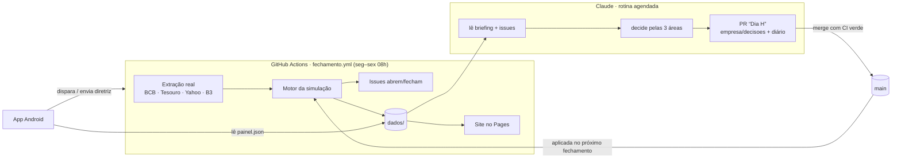

# Capivara Asset

Uma gestora de ativos **fictícia** que vive só no GitHub, operando sobre **dados públicos reais**
(Banco Central, Tesouro Direto, B3, Yahoo Finance). Todo dia útil ela extrai os dados, sofre com
fontes que atrasam ou saem do ar, monta os painéis com o que tem, decide e sente as consequências.

> Empresa e fundo fictícios. Nada aqui é recomendação de investimento.

- **Painéis:** site no GitHub Pages (`site/`), aberto também pelo app Android
  ([`GloedenJoao/android` → `apps/gestora`](https://github.com/GloedenJoao/android/tree/main/apps/gestora)).
- **Processos:** [issues com rótulo `simulacao`](https://github.com/GloedenJoao/profissional/issues?q=label%3Asimulacao)
  e [PRs do dia](https://github.com/GloedenJoao/profissional/pulls?q=label%3Adia).
- **Ideia original:** [`IDEIA.md`](IDEIA.md) · **manual do agente:** [`OPERACAO.md`](OPERACAO.md).

## Como um dia útil acontece



O motor (`gestora/simulacao.py`) roda as áreas em ordem, e cada uma herda os problemas da
anterior:

1. **Extração.** A extração real pode falhar (vira incidente `falha_real` e o agente corrige o
   conector). Além disso, o acaso do dia gera atrasos, quedas e mudanças de formato, mais
   prováveis quando a dívida técnica está alta. A equipe tem capacidade limitada para
   `aguardar`, ligar a `fonte_alternativa`, `corrigir_conector` ou `escalar`. Enquanto há
   incidente, o resto da empresa não vê os dados novos daquela fonte.
2. **Dashboards.** Com dado faltando, a área escolhe `usar_ontem`, `estimar` ou `suspender`.
   Estimativas são conferidas quando o dado real chega; erros derrubam a credibilidade.
3. **Executivos.** Decidem a alocação do fundo, a equipe e o orçamento de Extração com os
   números (e a confiança) que receberam. Ativo sem número confiável fica congelado.
4. **Fundo e gestora.** A carteira é marcada com preços reais; cotistas aplicam ou resgatam
   conforme o desempenho contra o CDI e a credibilidade; a taxa de administração paga a casa.

O estado de hoje (incidentes, dívida técnica, credibilidade, carteira, caixa) é o ponto de
partida de amanhã. O sorteio usa semente derivada da data, então o mesmo dia sempre dá o mesmo
resultado.

## Estrutura

| Pasta | O que tem | Quem escreve |
|---|---|---|
| `gestora/` | motor em Python puro (biblioteca padrão) | PRs de código |
| `dados/` | séries reais, estado, histórico, `painel.json`, `briefing.md` | só o workflow |
| `empresa/` | `politicas.json`, `decisoes/AAAA-MM-DD.json`, `diario/` | agente e humanos, por PR |
| `site/` | painéis (HTML + JS, gráficos em SVG) | PRs de código |
| `tests/` | testes do motor, parsers com respostas reais gravadas | PRs de código |

## Rodar localmente

```bash
python -m pytest -q                     # testes
python -m gestora fechamento            # extrai e simula (precisa de acesso às fontes)
python -m gestora fechamento --sem-extracao --data AAAA-MM-DD   # só simula
python -m gestora validar               # políticas e decisões pendentes
python -m http.server -d . 8000         # e abra http://localhost:8000/site/
```

## Ligar o site

Uma vez só: **Settings → Pages → Build and deployment → Source: GitHub Actions**. Depois disso,
cada fechamento publica o site em `https://gloedenjoao.github.io/profissional/`.
