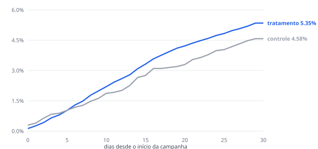

# Relatório de mensuração: Boas-vindas PJ — julho

## 1. Incrementalidade (tratamento x grupo de controle)

| Grupo | Clientes | Conversões | Taxa |
|---|---:|---:|---:|
| Tratamento | 17,968 | 961 | 5.35% |
| Controle | 2,032 | 93 | 4.58% |

- **Lift absoluto:** +0.77 p.p. (IC 95%: -0.19 a +1.74 p.p.)
- **Lift relativo:** +16.9%
- **Significância:** z = 1.56, p-valor = 0.1176 (não significativo a 5%)
- **Conversões incrementais estimadas:** 139
- **Poder do desenho:** com 10% de holdout, o menor efeito detectável (poder 80%) é **1.37 p.p.**; para detectar 1.0 p.p. o holdout precisaria ser de **22%**.

## 2. Atribuição last-touch (lookback 30 dias)

| Canal | Conversões atribuídas | % do total |
|---|---:|---:|
| crm | 790 | 75.0% |
| organico | 142 | 13.5% |
| midia_paga | 96 | 9.1% |
| gerente | 17 | 1.6% |
| mgm | 9 | 0.8% |

## 3. Leitura

O last-touch credita **790 conversões ao CRM**. O grupo de controle estima **~139 conversões incrementais** (IC 95%: 0 a 312). Mesmo no limite superior do intervalo, o last-touch superestima o CRM em **2.5x** (na estimativa pontual, 5.7x). O CRM toca todo o público, inclusive quem já ia converter, e fica com o crédito da última interação.

O teste de incrementalidade é **inconclusivo a 5%**. Isso *não* é evidência de que a campanha não funciona: com este holdout o desenho só detecta efeitos a partir de 1.37 p.p. É um problema de desenho, e se resolve antes do disparo.

**Recomendação:** usar last-touch para *distribuir* crédito operacional entre canais e usar grupo de controle para *decidir investimento*. Toda campanha nova da régua deve nascer com holdout **dimensionado antes do disparo** para o menor efeito que justificaria o custo da campanha.

---
*Base sintética (seed 42): lift real configurado = +1.50 p.p. sobre taxa base de 4.0%. A mensuração acima não conhece esse valor; ele está dentro do IC 95% estimado.*
