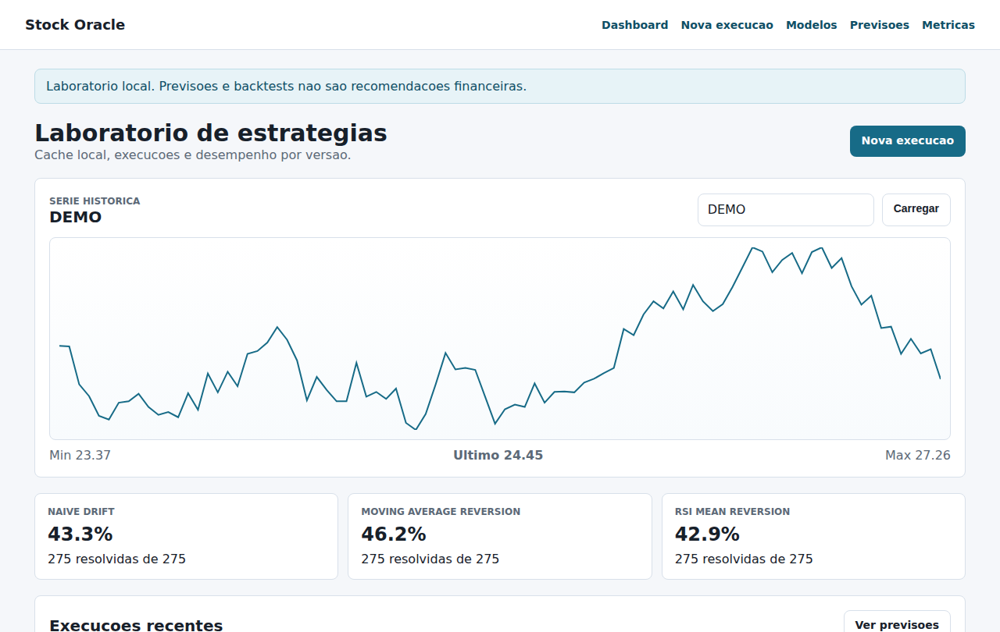
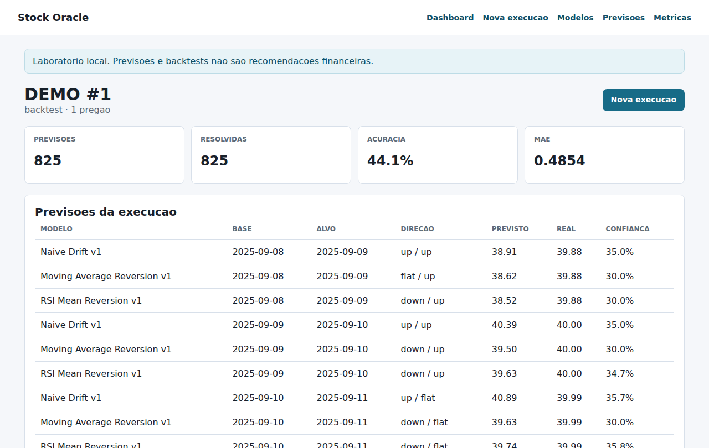

# Stock Oracle: laboratório para medir agentes de previsão

> O objetivo nunca foi prever a bolsa. Era aprender a **medir** agentes com um gabarito verificável: o preço de fechamento do dia seguinte. Toda previsão fica registrada e é comparada depois com o que de fato aconteceu.

**Stack:** Python · FastAPI · SQLAlchemy · SQLite · Jinja2 · yfinance · Anthropic SDK · pytest · Claude Code



> Screenshots geradas com uma **série de preços sintética** (passeio aleatório), já que o ambiente de captura não tinha acesso ao Yahoo Finance. Em um passeio aleatório nenhuma estratégia deveria acertar a direção de forma consistente, e as três ficam em 43–46%. O laboratório existe para mostrar isso antes que alguém aposte dinheiro numa estratégia.

## O que faz

- **Catálogo versionado de estratégias.** Cada estratégia tem hipótese, parâmetros e código, e cada mudança gera uma versão nova com hash do código. Nenhum resultado é atribuído à versão errada.
- **Execução em sandbox.** O código da estratégia é validado por AST (sem imports, I/O, `eval/exec` ou estado global) e roda com um contrato fixo: `StrategyContext → StrategySignal(predicted_price, confidence, reasoning)`.
- **Backtest rolante.** Roda a estratégia pregão a pregão sobre o cache local de OHLCV. Toda previsão é persistida e resolvida contra o preço real.
- **Métricas por versão:** acurácia de direção (total e nas últimas 20 previsões) e MAE. O botão "mutar" cria uma variação dos parâmetros para comparar versões.
- **Offline-first:** só o refresh de mercado chama a rede. Backtests e testes leem SQLite.



## Como foi construído

Tudo em uma noite (15/06/2026), em três commits e com um pivô no meio. É esse processo que o projeto mostra:

1. **Planejamento antes do código.** Comecei por um [plano de 346 linhas](docs/PLANO_ORIGINAL.md) com arquitetura multiagente: agentes de histórico, sentimento de notícias e fundamentos, cada um chamando o Claude, mais um orquestrador que consolida as previsões e um avaliador que confere com o preço real.
2. **v1: agentes LLM** (`feat: bootstrap`). Implementei o contrato de agente, o adapter do Claude, o pipeline de previsão, a avaliação, as métricas e a UI. Tudo com testes e com as regras de arquitetura escritas em `CLAUDE.md` por camada (`app/`, `agents/`, `services/`, `models/`, `routers/`, `tests/`), para que o agente de código respeitasse as fronteiras.
3. **Pivô: laboratório local** (`Transform stock oracle into local strategy lab`). Ao usar a v1 ficou claro que medir um LLM prevendo preço é **caro, lento e não reproduzível**: a mesma pergunta gera respostas diferentes e cada backtest custaria milhares de chamadas. Por isso troquei a unidade de medida: estratégias locais, determinísticas e versionadas, rodando em sandbox e com backtest barato. O adapter do Claude e o pipeline da v1 continuam no código como referência, mas fora da UI.

A lição, que levo para o trabalho com IA aplicada: **antes de otimizar um agente, garanta que dá para medi-lo de forma barata e repetível.**

## Arquitetura

```
app/
├── agents/     contrato de estratégia, sandbox (validação AST), seeds do catálogo, adapter Claude (v1)
├── services/   execução e backtest, catálogo/versões, métricas, cache de mercado
├── models/     SQLAlchemy: modelos, versões, execuções, previsões, barras OHLCV
├── routers/    só HTTP (páginas e API JSON)
└── data/       fetchers (yfinance) e indicadores técnicos
```

Cada pasta tem um `CLAUDE.md` com as regras daquela camada: é a documentação que orienta tanto quem lê o código quanto o agente que ajuda a escrevê-lo.

## Rodando

```bash
pip install -e ".[dev]"
python scripts/init_db.py      # cria o banco e o catálogo inicial
python scripts/run_dev.py      # http://127.0.0.1:8000
pytest                         # 26 testes, sem rede (fetchers mockados, SQLite temporário)
```

## Limites conhecidos

- O sandbox é uma proteção **em processo** para código confiável. Não é fronteira de segurança para código hostil (está documentado em `app/agents/CLAUDE.md`).
- Acurácia de direção em série diária é uma métrica ruidosa. O próximo passo seria comparar cada estratégia com o baseline "amanhã = hoje" e usar intervalos de confiança.
